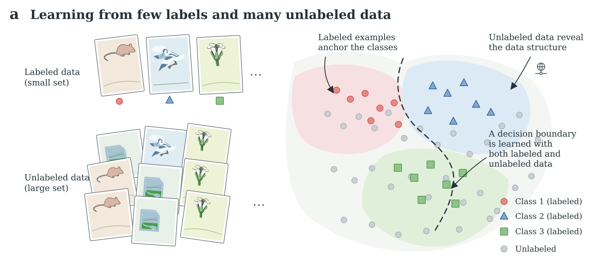

# Nature Vector Reconstruction

把一张 AI 生成的参考图转换为**可编辑的 SVG**，再由 Inkscape 导出为高清 PDF、EPS 和 PNG。仓库把参考图当作视觉输入，输出只保留路径和基本形状，适合在 Inkscape 中继续改色、改轮廓、拆层和重建文字。

当前推荐的视觉策略仍然是：**Bioicons 负责科学对象形状；Inkscape 统一改色和轮廓；Lucide 或 Tabler 只负责少量结构符号。** 27 个可复用素材来源见 [`docs/asset_source_registry.md`](docs/asset_source_registry.md)。

## 先说清楚“无 AI 痕迹”

本仓库把它定义成可检查的文件条件：

- 最终 SVG 不含 `<image>`、PNG/JPG、外部图片、AI prompt 或生成器元数据；
- 不保留渐变、滤镜、阴影和外链引用；
- 主要内容由 `<path>` 和基础几何形状组成；
- 通过 `tools/qa.py` 检查后，SVG 可以独立打开和编辑。

自动矢量化会忠实地把参考图中的纹理、错字或错误结构变成路径，因此它不是“自动保证科学正确”的一键投稿图。正式图应在 Inkscape 中做最后的语义清理：重打文字、重画箭头和坐标轴、删掉碎片、给对象分层并记录素材许可。

## 你不需要本地安装 Inkscape

有三种运行方式：

1. **GitHub Codespaces（推荐）**：仓库自带 `.devcontainer`，创建 Codespace 后会自动启动浏览器版 Inkscape 桌面；Codespaces 转发私有的 6080 端口后，在浏览器打开 Inkscape。终端中可运行 `make setup && make all`。
2. **GitHub Actions**：把参考图提交到 `input/`，Actions 会安装 Inkscape、完成矢量化、质检和导出，并把结果作为 artifact 提供下载。
3. **Docker**：使用根目录 `Dockerfile`，适合在任何有 Docker 的电脑或服务器运行。

## 最短路径

```bash
# 在仓库根目录
cp /path/to/ai-reference.png input/reference.png
make setup
make all
```

结果在 `outputs/`：

```text
reconstructed.svg             # 可编辑矢量母版
reconstructed.pdf             # Inkscape 导出，适合排版
reconstructed.eps             # Inkscape 导出，兼容传统投稿流程
reconstructed.png             # 高清预览
reconstruction_report.md      # 输入 hash、参数、路径数和工具版本
qa_report.md                  # 无栅格/无外链检查
```

如果只想先生成 SVG，不需要 Inkscape：

```bash
make reconstruct
make qa
```

`make export` 和 `make all` 会明确要求 Inkscape；在本地没有 Inkscape 时，改用 Codespaces、Actions 或 Docker。

## GitHub Actions 用法

1. 把一张 `reference.png`、`reference.jpg`、`reference.jpeg` 或 `reference.webp` 放进 `input/` 并提交。
2. 打开仓库的 **Actions → Reconstruct vector figure → Run workflow**，或等待 push 触发。
3. 在运行页面下载 `reconstruction-bundle` artifact。

Actions 只使用 `input/` 中的第一张图片。不要把未公开的研究图片提交到公共仓库。

## 在浏览器中使用 Inkscape

1. 在 GitHub 仓库点击 **Code → Codespaces → Create codespace**。
2. 等待初始化完成，Codespaces 会自动转发 `6080` 端口并打开浏览器版 Inkscape。
3. 上传图片到 `input/`，在 Codespaces 终端运行 `make setup && make reconstruct`。
4. 在 Inkscape 中打开 `outputs/reconstructed.svg`，完成文字、箭头、图层和对象形状整理；再运行 `make export` 生成投稿文件。

端口设为 **private**，VNC 服务只监听容器本机地址。停止桌面可运行 `bash tools/stop_inkscape_desktop.sh`。

## 调整风格

修改 [`config/style.yaml`](config/style.yaml)：

- `input.quantize_colors`：颜色数量；平面科学图一般 12–32；
- `input.max_dimension`：送入描摹的最大边；
- `trace.*`：VTracer 的轮廓、碎片过滤和路径精度；
- `output.palette_mode`：`nearest` 把颜色归一到 Nature 风格调色板，`keep` 保留量化后的颜色；
- `output.palette`：按项目换成自己的 palette。

图里若有文字、箭头、数据点和规则几何，不要依赖自动描摹来保留它们。把参考图放在 Inkscape 的锁定参考层，使用原生文字、线段、箭头、圆、矩形重建，再把自动描摹层当作对象形状参考。

## 目录

```text
config/style.yaml                  # 可复用的色板和描摹参数
tools/reconstruct.py               # 参考图 → 清洗后的 SVG
tools/qa.py                        # SVG 结构检查
tools/export.py                    # Inkscape → PDF/EPS/PNG
tools/start_inkscape_desktop.sh    # Codespaces 浏览器桌面
.github/workflows/reconstruct.yml  # 无本地工具时的云端运行
.devcontainer/                     # Codespaces 环境
input/                             # 放一张参考图
outputs/                           # 运行结果（默认不提交）
docs/asset_source_registry.md      # 27 个素材来源和许可提醒
docs/scientific_figure_reproduction_workflow.md  # 完整复现工作流
examples/panel_a/                  # Bioicons + Tabler 的示例母版
```

## 素材许可

不要把“能下载”当成“可以发表”。每个素材都要在 [`docs/asset_manifest_template.csv`](docs/asset_manifest_template.csv) 记录来源、作者、许可证、许可证网址、下载日期、hash 和修改方式。默认优先：Public Domain/CC0、MIT、ISC、Apache 2.0；CC BY/CC BY-SA 要按要求署名或继续采用相应许可；NC/ND、订阅和平台条款要先确认发表及商业范围。完整规则见 [`docs/license_policy.md`](docs/license_policy.md)。

## 示例

[`examples/panel_a/panel_a_bioicons_v02.svg`](examples/panel_a/panel_a_bioicons_v02.svg) 是此前 Panel A 的可编辑母版：Bioicons 提供对象形状，Inkscape 统一颜色和轮廓，Tabler 只提供一个结构符号。示例中的 Arabidopsis flower 需要保留 CC BY 4.0 署名，详情见同目录的 source manifest。



## 代码许可

本仓库的脚本采用 MIT。第三方素材仍然服从其各自许可证；请阅读 `NOTICE.md` 和每项素材的 manifest。
